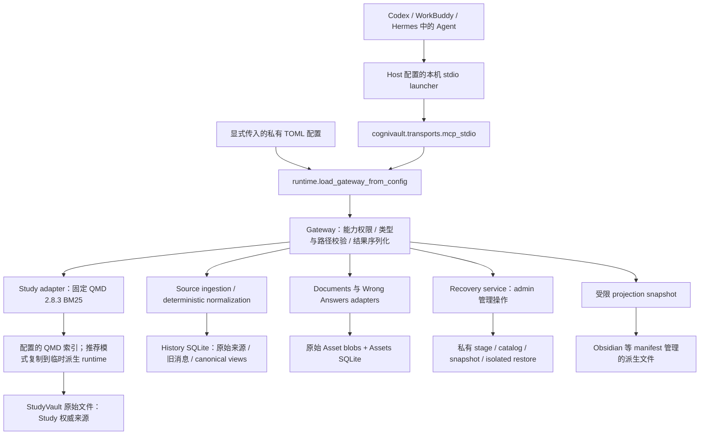
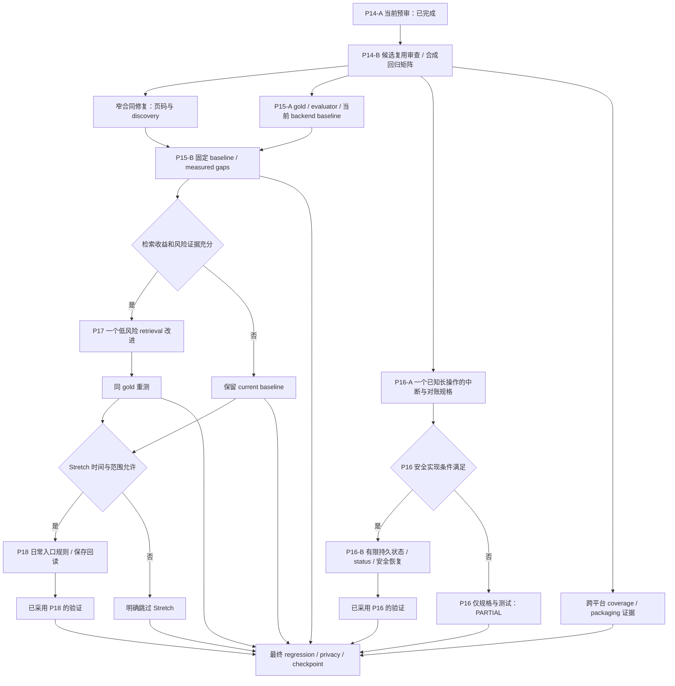

# CogniVault 发布后架构预审与三天开发框架

审计日期：2026-10-07，Asia/Shanghai。执行窗口：2026-10-07 下午至 2026-10-10 下午。

**结论：保留当前 SQLite / files / QMD / Gateway 架构。下一轮最值得做的是补齐主线的检索评价、修复已经复现的接口约束冲突，再为一个已知长操作建立有限任务恢复。现在没有检索质量证据支持替换搜索引擎，也没有理由引入另一套 Memory runtime。**

本轮完成公开工程文件和 Git 对象的调查、当前代码合成测试、隔离打包安装与三个合成问题复现；只新增本报告和[执行计划](../superpowers/plans/2026-10-07-three-day-autonomous-development.md)。没有改动领域代码、权限配置或真实资料，没有启动客户端绕过当前缺失的 MCP 连接。

## 1. Current Architecture

### 1.1 代码中的实际调用链



这条链基本符合 `Agent thinks; Gateway executes`，但不是所有操作都先进入同一种 service，也不是每个写入都依次执行 `commit → receipt → readback`。Gateway 部分方法把权限校验委托给 ingestion、normalization、recovery service；不能因为委托方法没有直接写权限语句，就认定它绕过检查。

代码入口：[stdio main](../../src/cognivault/transports/mcp_stdio.py#L674)、[runtime](../../src/cognivault/runtime.py#L18)、[Gateway](../../src/cognivault/gateway.py#L106)。核心 contract / Gateway 不包含模型调用；[架构边界测试](../../tests/test_phase4_architecture.py#L181)覆盖这一点。`chatgpt_study_system.transports.mcp_stdio` 是委托到同一实现的旧启动 shim，不是第二个 Gateway。

| Agent / Host | 实际接入机制 | 当前证据边界 |
|---|---|---|
| Codex | `.codex/setup_mcp.py` 生成项目 launcher，显式指定 config、cwd、`--no-sync`，启动 canonical stdio module | 当前聊天 cwd 与审计 worktree 匹配，但该 worktree 没有私有配置或生成的 `.codex/config.toml`；注册和项目信任生效状态未验证 |
| WorkBuddy | 客户端 MCP JSON 注册同一 stdio 命令；隔离测试使用独立 alias、config 和物理 target | [setup 文档](../workbuddy-host-setup.md#L24)与 P12 历史证据存在，本轮没有真实 GUI / Host trace |
| Hermes | Hermes 本地 MCP 配置启动同一模块；client identity 是 reported metadata | [setup 文档](../hermes-host-setup.md#L54)与历史原生调用证据存在，本轮没有真实 Host trace |

当前 transport 是本机 stdio，没有内建 HTTP listener。Host 的 sandbox 或隐藏工具只是入口表现；最终权限由 Gateway / service 检查。caller identity 是 `reported / unverified`，不构成身份认证。

### 1.2 Stores、权威来源与 ownership

| 数据域 | 数据类型 / storage engine | Source of truth | 派生 / index 层与 ownership | 证据 |
|---|---|---|---|---|
| Study | 用户显式配置的 StudyVault 文件；QMD 外部命令及派生 SQLite 索引 | 原始 StudyVault 文件 | QMD index/config/cache；Gateway 只检索，不拥有 Study 编辑事务。推荐模式每次检索复制派生状态；旧 launcher 模式仍存在 | [Study adapter](../../src/cognivault/adapters/study_qmd.py#L149)、[snapshot](../../src/cognivault/adapters/qmd_snapshot.py#L26) |
| 旧 History items | 配置的 History SQLite：sources/content/items + FTS5 | 有明确来源、角色和时间的已导入消息及其来源证据 | FTS5 为派生检索层；payload 去重与 occurrence 身份分开 | [history schema](../../src/cognivault/adapters/history.py#L103) |
| Legacy / Source Evidence | 同一 History SQLite：原始 BLOB、metadata、typed source records；`inline / legacy / manifest` payload binding | 原始来源 bytes 与 descriptor / evidence refs | Gateway owning store；私有 archive / manifest 保存部分外部原始容器，不伪造成 canonical 聊天 | [sources](../../src/cognivault/adapters/history_sources.py#L51)、[legacy](../../src/cognivault/adapters/legacy_sources.py#L120) |
| Canonical History | 同一 History SQLite：conversations、messages、views、message evidence、nodes、outcomes | 原始 source evidence；canonical 是确定性解释 | 可重建的版本化 canonical 层，由 Gateway 管理；含糊/不支持输入继续 source-only | [canonical schema / persist](../../src/cognivault/adapters/canonical_history.py#L50)、[normalizers](../../src/cognivault/normalization/adapters.py#L35) |
| Assets / Documents | SHA-256 寻址原始文件 + 独立 Assets SQLite：assets/documents/pages/chunks | 原始 Asset bytes | PDF text layer、OCR、pages、chunks 为派生表示；Gateway 管理数据库与对象文件，二者不是一个原子事务 | [documents](../../src/cognivault/adapters/documents.py#L872) |
| Wrong Answers | 同一 Assets SQLite：不可变 source、追加 analysis、request keys、provenance/audit | 原题 bytes、source 引用与不可变题目/学生答案记录 | Agent analysis 是版本化 `agent_generated` 数据；不同版本不覆盖旧分析，不能当作新的作答次数 | [wrong-answer schema](../../src/cognivault/adapters/wrong_answers.py#L55) |
| Provenance / audit | 附着在各 owning SQLite connection 的表 | 正式写入时记录的 origin、source refs、版本、Gateway 时间和 reported identity | 操作 metadata；不是独立跨数据库 transaction ledger，不存模型推理或任意原文日志 | [provenance](../../src/cognivault/provenance.py#L87) |
| Migration / acquisition | 私有 MigrationJournal、HistoryMigrationLedger SQLite，registry、receipts、raw archive、Codex snapshot 文件 | 特定采集/迁移运行的来源与处理证据 | 负责准备与对账，不是第二份在线 V2 权威数据；ledger 也不证明当前 Gateway 数据状态 | [journal](../../src/cognivault/migration/manifest.py#L195)、[ledger](../../src/cognivault/migration/history_ledger.py#L69) |
| Recovery / projection | 私有文件、SQLite snapshots、manifest/catalog/proof；manifest 管理的 Markdown projection | 原始指定数据源仍是在线权威 | 快照、isolated restore、Obsidian projection 仅用于备份、验证和展示 | [recovery](../../src/cognivault/recovery/service.py#L202)、[ownership 文档](../architecture.md#L55) |
| Memory | **没有内建 MemoryStore 或 durable profile service** | Host 自己管理偏好；Study / History / Archive 分域 | Basic Memory 是外部历史来源/曾设想的 adapter，当前 runtime 仅支持 History `sqlite / not_configured`；不应把项目愿景当成已实现的记忆服务 | [ADR-005](../adr/ADR-005-Memory-Layers.md#L12)、[runtime](../../src/cognivault/runtime.py#L29) |

Memory 的缺失不自动构成这三天必须补的功能。当前架构已经明确把稳定偏好、来源证据、学习资料和对话历史分开；重建自动提炼记忆的大脑会改变产品边界。

### 1.3 实际写入路径

| 路径 | 实际顺序 | 原子性 / 回查边界 |
|---|---|---|
| Asset / Document | capability / typed input / 路径校验 → bytes/hash/media/page 预处理 → 临时 blob 后 `os.replace` → SQLite metadata/pages/chunks/provenance/audit commit → DTO | 单数据库批次有事务；blob 和 DB 依赖异常补偿，没有共同事务。完整原字节回查是独立 fetch；blob publish 无显式 fsync |
| 保存错题 | 原始 asset 已存在或显式注册 → register immutable source → save analysis / request key / provenance / audit → DTO → 可单独 bundle 回读 | source registration 与 analysis saving 是两次事务。analysis 内部 `BEGIN IMMEDIATE`，digest + `expected_version` 检查与数据同事务提交；部分成功必须明确报告 |
| History sources | manifest/inbox/hash 校验 → 每 source commit → `store.verify` 原字节回查 → 汇总部分结果 → receipt `flush/fsync` → response | 实际是 `commit → readback → receipt`；receipt 失败不会回滚已经提交的 sources |
| Canonical normalization | source-set hash / cursor → 原 bytes checksum → 确定性 parser → 每 source transaction → 最终 source-set 再校验 → receipt fsync | 每 source 同事务保存完整派生结果；整批不是单一事务。完整 materialization / reparse 校验是独立 API |
| Legacy apply | 显式来源 preflight → backup / isolated proof → journal planned → domain commit → exact readback → journal committed | domain 与 journal 分开；已有 commit-before-journal 重放测试，不能称跨库 exactly-once |
| Recovery snapshot | capacity/inventory → 数据库 writer reservations → WAL-aware copy/hash → manifest/checksum fsync → 完整 payload/schema/logical proof → catalog fsync → stage rename 为 final → response | 完成快照可重验再复用；未完成 stage 保留。catalog 与 final 发布存在中断窗口，见第 4 节 |

上述路径的关键测试：[analysis version / provenance](../../tests/test_wrong_answers.py#L233)、[source receipt](../../tests/test_source_gateway.py)、[canonical rollback](../../tests/test_canonical_gateway.py#L110)、[commit-before-journal](../../tests/test_real_migration_apply.py#L84)、[isolated restore readback](../../tests/test_recovery.py#L432)。本轮全集执行覆盖这些现有测试，但没有因此证明所有硬进程中断或跨介质原子性。

### 1.4 实际读取路径

所有 V2 数据读取、计数与存在性检查仍要求经过正式 Gateway。当前代码的查询不是统一的 `retrieval → ranking → citation` pipeline：

- Study：query/limit → read capability → 固定 collection → QMD BM25 → 保留返回顺序/score → URI/allowlist 再校验 → `study:` source、snippet；没有 page/chapter 字段。
- Document：query/limit/offset → read → 全库最多 2,048 chunks → Python AND 子串过滤 → URI/page/chunk 固定顺序 → chunk/page/source asset locator → 可显式获取原 PDF 页图。
- 旧 History：source/conversation scope → FTS5 AND 前缀 → `created_at DESC`；FTS 无结果才走有界 typo fallback。它不是 BM25 排名。
- Source-only History：source_system scope → metadata 子串 → source_id 排序；不搜索 raw 正文。
- Canonical History：source_system scope → conversation ID / message.text 的 SQLite `instr` → conversation_id 排序。
- Wrong Answer：最多 2,048 sources → 题目/学生答案/最新 analysis JSON 的 AND 子串 → source 注册时间倒序 → bundle 保留 source 与所有 analysis versions；没有时间窗参数。

返回逻辑来源和物理页定位有代码，但“返回 citation 字段”不等于“引用内容正确”。页号是 PDF 物理页序号，不是印刷页码。现有 Markdown section 切块也不等于稳定的跨页 chapter identity。

## 2. Current State

### 2.1 当前仓库与正式发布

| 项目 | 2026-10-07 核实结果 |
|---|---|
| 仓库 | 会话指定的 `b36f/chatgpt-study-system-v2` worktree；`git rev-parse --show-toplevel` 与会话目录匹配 |
| Branch | detached HEAD；不是名为 main 的 checkout，但 HEAD 与本地 main、实时远端 main 相同 |
| HEAD / remote main | `c4e8b63e0425c7c89e9e03ed3f104ae36e27edbc` |
| origin | [abdullejan25-max/cognivault](https://github.com/abdullejan25-max/cognivault) |
| 开始时工作树 | clean；本轮交付后只有报告和计划新增 |
| 包身份 / 版本 | distribution/import/MCP：`cognivault`；`pyproject.toml` 为 `0.8.0`；旧启动模块仅 shim |
| 正式 v0.8.0 | annotated tag object `7e82290d0c9f4902dae58ba837161d1ecf6ee24c`；peeled target `748ef70e7ac29bde3ce6c01d04333ac0ee9e5526`；[Release](https://github.com/abdullejan25-max/cognivault/releases/tag/v0.8.0)已发布 |
| main 比 tag 多什么 | Windows `install.cmd`、`install.ps1`、`setup_local.py`、配套测试/CI/docs 和小型 bootstrap/runtime 调整；不能假设标签也含安装器 |

### 2.2 本轮验证与真实验收边界

| 验证 | 结果 | 证据范围 |
|---|---|---|
| 锁文件 | `uv lock --check` 成功 | 当前 checkout 的 lock |
| 本机安全合成全集 | **875 passed / 12 skipped，310.42s** | Windows、Python 3.12.8、锁定 dev 环境；所有 sources/stores 为现有测试的人工合成临时目录 |
| 另行启用的 QMD runtime smoke | **1 passed，1.14s** | 已核实本机 `@tobilu/qmd 2.8.3`，真实 Node/QMD 命令处理临时合成资料；不代表真实 StudyVault 效果 |
| Wheel / sdist | 成功；**63 / 239 entries**，内容审计通过 | 本轮源码构建；在报告生成之前完成，不是发布新版本 |
| 全新 wheel 安装 | `python -I` import、distribution version、已安装 workflow resource 检查通过 | 独立安装环境；不证明当前 Desktop 已连接 |
| 当前 main CI | [run 37429945715](https://github.com/abdullejan25-max/cognivault/actions/runs/37429945715)三 jobs success，head 正是 `c4e8b63` | Ubuntu core **871 passed / 16 skipped**；Ubuntu wheel/sdist/install；Windows 选定 compatibility tests + build/install。Windows CI 不是完整全集 |
| 本轮问题复现 | 第 65 页错题注册失败；readonly normalization discovery 漂移；catalog-before-publish 中断后同 key retry 失败 | 仅人工合成资料和定点故障注入，见第 4 节 |
| 当前 native Gateway / Host | **UNKNOWN** | 本聊天没有 `cognivault` tool；直接读 `study-workflow://wrong-answer` 得到 `unknown MCP server 'cognivault'`；worktree 缺私有 Gateway config 与 `.codex/config.toml` |
| 当前生产 counts / integrity / backup 状态 | **UNKNOWN** | 未读取生产 stores；历史 counts 与 Host PASS 不作为本轮实时事实 |

12 个 skip 中包括 CLI Host opt-in、真实数据 QMD opt-in、合成 QMD opt-in、可选 PyMuPDF 页图和当前系统无法创建的 symlink/junction/FIFO/POSIX 权限测试。第三项 QMD 后来单独启用并通过；**不要将两次运行拼写为一次“完整 876 passed”**。CLI inline override 与真实数据 smoke 本轮明确禁用。已有 SDK / stdio 合成测试的执行不作为 native Desktop、WorkBuddy 或 Hermes PASS。

生产 MCP 缺失不会阻止公开源码审计、合成测试、私有数据无关的 benchmark 开发，但会阻止当前 native Host 与真实数据验收。项目信任状态不能由本轮工具查证；本工作区没有可加载的生成配置是已确认事实。依照 [AGENTS.md](../../AGENTS.md) 和 [Gateway-only rule](../../.codebuddy/rules/study-system-gateway-only.md)，没有用 direct client、inline override 或直接 SQLite 补验收。

### 2.3 找到了历史 benchmark，但它不在 main

Git 全历史搜索找到了：

```text
071efd8:docs/research/v0.8-github-architecture-benchmark.md
27253cc:docs/research/v0.8-retrieval-benchmark.md
codex/v0.8-operational-reliability HEAD = b82d32c6a33fe6a77cebcc4a608e30719ce76cb7
main 与该分支共同祖先 = 7f83508d774233c1f4e3103bf751cfe78bd17c9d
```

原 benchmark 为 2026-10-03 的 359 行研究文档。它提出 Control Plane、有限恢复、retrieval evaluation、三条日常入口和跨平台可靠性；仍是研究建议，不是本轮实施授权。可以用 `git show 071efd8:docs/research/v0.8-github-architecture-benchmark.md` 完整读取，不能伪造一个当前主线不存在的文件链接。

| 历史建议 | 当前 main 再审计 | 分支中已有的候选 | 处理 |
|---|---|---|---|
| Control Plane / safe merge | capability 检查已有；purpose/target/profile binding 缺失 | `803a953`、`b375d86` 的 control plane、status、semantic merge | 先审查兼容性与测试，不重新盲造，也不整分支合并 |
| Finite Task Recovery | 业务幂等和特定迁移重放已有；统一 job/lease 缺失 | `3075048` 的 operation ledger / resume package | 候选也只有部分 handler，其他 retry/resume/cancel fail-closed；不能说“已全面恢复” |
| Retrieval Evaluation | 主线没有效果 benchmark | `27253cc` 的 6-case synthetic runner / report | 可借 machinery，须修指标分母/结果单位和扩充 gold |
| Daily Workflows | 正式 wrong-answer workflow 已有；另外两条不足 | `db03e6d` 的 batch/lifecycle、daily workflow 文档 | 本轮不默认引入 attempt/lifecycle 新模型 |
| Cross-platform Reliability | 现 main Ubuntu / Windows CI、wheel/sdist/install 已明显前进 | 老分支未含当前安装器 / rename | 主要补证据与 coverage；不用复刻已完成的安装/CI |
| 页码统一 | 64/999 bug 仍在 main | `d2186a9` 已有修复候选 | 迁到 canonical 模块时先复现、测试；旧 commit 存在不代表发布已有 |

以上相关 commit 对 `HEAD` 的 ancestry 检查均未通过。旧分支仍以 `chatgpt_study_system` 为主包，还保留候选发布状态与主线不同的 admin 语义；**不能 bulk cherry-pick、整分支 merge，或把旧测试数字当当前主线验收**。历史研究的上游 commit/license/issue 状态只作为当时快照。本轮仅新核对与决策直接相关的 [LangGraph persistence 文档](https://docs.langchain.com/oss/python/langgraph/persistence)和 [QMD 官方仓库](https://github.com/tobi/qmd)，没有重做九个上游的完整 benchmark，也没有复制上游代码。

## 3. Gap Matrix — P14 Re-Audit

`PASS` = 当前代码具备该明确能力，且对应现有合成测试本轮通过；不扩张为真实数据/Host PASS。`PARTIAL` = 已有部分路径但不能满足完整语义；`MISSING` = 当前 main 无该能力；`NOT APPLICABLE` = 当前架构不承担该职责；`UNKNOWN` = 本轮缺现场证据。下列 Status 每格只用这五种值。

### A. Control Plane

Control Plane 在这里指“统一说明用途、目标和有效权限，并使 Host 的工具可见性与最终执行一致”，不是再建 Agent。

| Area | Capability | Status | Evidence | Recommended Action |
|---|---|---|---|---|
| Control Plane | 单一 capability 配置 / 默认 read | PASS | [runtime:86](../../src/cognivault/runtime.py#L86)、[默认权限测试:82](../../tests/test_phase8_permissions.py#L82) | 保留，补统一操作定义时沿用 |
| Control Plane | purpose / target / capability 统一来源 | MISSING | [AppConfig:8](../../src/cognivault/config.py#L8)无 purpose/target/profile；当前权限是独立字段 | MEDIUM：审查旧候选 binding，先加合成兼容矩阵 |
| Control Plane | production / isolated 物理边界 | PARTIAL | [WorkBuddy setup:24](../workbuddy-host-setup.md#L24)、[inbox guard:39](../../src/cognivault/migration/gateway_sources.py#L39)；靠配置与路径边界，没有统一环境绑定 | 保留现有 aliases；标签不能替代实际后端隔离证明 |
| Control Plane | profile / target fingerprint / effective capabilities 查询 | MISSING | [health:622](../../src/cognivault/gateway.py#L622)不报告这些字段 | MEDIUM：最小脱敏诊断；fingerprint 不是认证凭证 |
| Control Plane | Gateway read / write / ingest / projection enforcement | PASS | [require capability:113](../../src/cognivault/gateway.py#L113)、[read enforcement test:103](../../tests/test_phase8_permissions.py#L103)、[normalization:41](../../src/cognivault/normalization/execution.py#L41) | 不用 Host sandbox 代替；保留 main 的 admin 兼容语义 |
| Control Plane | MCP exposure 与执行边界一致 | PARTIAL | [发现分类:374](../../src/cognivault/transports/mcp_stdio.py#L374)遗漏 normalize；本轮 readonly fixture 复现 | LOW：补所有工具的 discovery/enforcement matrix，再做窄修复 |
| Control Plane | setup 保全既有 private config / unknown 内容 | PASS | [setup_local:14](../../scripts/setup_local.py#L14)、[字节保全测试:95](../../tests/test_install_setup.py#L95) | 保留；未知配置拒绝不等于破坏/丢失 |
| Control Plane | 多 server 自动 semantic merge | PARTIAL | [.codex helper:239](../../.codex/setup_mcp.py#L239)：已有兼容 canonical server 时保全；否则拒绝并保全，没有通用插入 | MEDIUM 条件项：需求确实存在才移植候选 merge，保留 unknown fields |
| Control Plane | rejection reason / 脱敏诊断 | PARTIAL | [公开错误码](../../src/cognivault/contracts.py#L8)、[错误脱敏测试:256](../../tests/test_mcp_stdio.py#L256)；有效目标/缺哪种能力未说明 | LOW 文档；新增诊断字段须兼容、不打印路径 |
| Control Plane | 当前三 Host 配置生效与 target 一致 | UNKNOWN | 本聊天 unknown server；[历史 Host 范围](../current-state.md#L26) | 真实 Host 另行受支持连接验收；独立工程继续 |
| Control Plane | Gateway 证明 Host trust / reload | NOT APPLICABLE | [setup_local:65](../../scripts/setup_local.py#L65)明确不验证真实会话 | 使用真实 Host trace，不制造 health 替代证据 |

### B. Recovery

ledger 是持久账本；receipt 是操作结果回执。数据库锁不是 worker lease：lease 要说明谁拥有任务、何时过期、旧执行者如何被阻止继续提交。

| Area | Capability | Status | Evidence | Recommended Action |
|---|---|---|---|---|
| Recovery | durable job / task 状态 | MISSING | [仅 plan/create/verify](../../src/cognivault/transports/recovery_tools.py#L5)；主线无 operations 模块 | MEDIUM：限定一个现有操作，不造任意 workflow engine |
| Recovery | migration / acquisition ledger | PASS | [journal](../../src/cognivault/migration/manifest.py#L195)、[ledger](../../src/cognivault/migration/history_ledger.py#L69)、[失败事件测试:205](../../tests/test_history_ledger.py#L205) | 已存在；不要重复实现 |
| Recovery | 统一 execution ledger | MISSING | 上述 ledger 记录特定来源/迁移，不表示运行中的 recovery job | 先审查 `3075048`，并记录不支持的 kinds |
| Recovery | 来源/normalize 的持久 receipt 与 snapshot proof | PASS | [source receipt:175](../../src/cognivault/migration/gateway_sources.py#L175)、[normalize receipt:72](../../src/cognivault/normalization/execution.py#L72)、[深路径测试:385](../../tests/test_recovery.py#L385) | 保留；并非所有 write 都有外部 receipt |
| Recovery | 业务 idempotency / duplicate submit | PASS | [analysis requests:290](../../src/cognivault/adapters/wrong_answers.py#L290)、[source identity](../../src/cognivault/adapters/history_sources.py#L87)、[重复导入测试](../../tests/test_history_sources.py) | 复用原 key + 完整 payload；不称全程 exactly-once |
| Recovery | 当前 job status query | PARTIAL | [plan 聚合 stage:102](../../src/cognivault/recovery/service.py#L102)及领域 outcomes 有；没有运行 job owner/status | MEDIUM：先补可观察性，再做自动接管 |
| Recovery | resume / checkpoint 重放 | PARTIAL | [Codex complete staging:469](../../src/cognivault/migration/codex_snapshot.py#L469)、[archive manifest:197](../../src/cognivault/migration/raw_archive.py#L197)、[journal retry:84](../../tests/test_real_migration_apply.py#L84) | 保留局部恢复；不要描述成完全没有 resume |
| Recovery | integrity / reconciliation | PARTIAL | [canonical verification](../../src/cognivault/normalization/integrity.py#L27)、[完整回查测试:303](../../tests/test_canonical_gateway.py#L303)；无全局任务副作用对账 | 根据领域结果判断 completed/needs_action，不自动 repair |
| Recovery | partial result / failed artifact 保全 | PASS | [stage:211](../../src/cognivault/recovery/service.py#L211)、[失败 stage 测试:356](../../tests/test_recovery.py#L356)、[文档:71](../p13-recovery.md#L71) | 保留 partial；不能偷偷删除或覆盖 |
| Recovery | 所有阶段 process crash 恢复 | PARTIAL | SQLite 原子事务、异常 rollback 与局部 artifact replay 已有；本轮复现 catalog-after-write 窗口 | LOW 先加故障测试；MEDIUM 才调整已知任务恢复语义 |
| Recovery | commit-before-receipt/checkpoint | PARTIAL | [Legacy 专项测试:84](../../tests/test_real_migration_apply.py#L84)、[asset checkpoint:258](../../tests/test_legacy_asset_apply.py#L258)；source/normalize DB 与 receipt 分开 | 复用领域 readback；不得把缺 receipt 当未提交而盲重写 |
| Recovery | stale conflict | PASS | [expected_version:305](../../src/cognivault/adapters/wrong_answers.py#L305)、[source-set change test:57](../../tests/test_canonical_gateway.py#L57) | 冲突停止依赖步骤，重新读取并协调；不自动覆盖 |
| Recovery | worker / event-loop 响应 | PARTIAL | [to_thread:518](../../src/cognivault/transports/mcp_stdio.py#L518)、[MCP ping test:53](../../tests/test_recovery.py#L53) | 已有进程内 worker，缺重启后的任务所有权 |
| Recovery | lease / heartbeat / fencing | MISSING | [DB reserve:198](../../src/cognivault/recovery/io.py#L198)持有 SQLite 事务锁，finally 关闭连接释放 | 没有 TTL、heartbeat 或 fencing，不能据此证明任务所有权；worker 存活不明时不自动接管 |
| Recovery | cooperative cancellation | MISSING | [文档:62](../p13-recovery.md#L62)明确取消 await 不停止 worker | 如本轮不实现，明确 unsupported；不宣传取消成功 |
| Recovery | Study 写入恢复事务 | NOT APPLICABLE | [Study authority](../architecture.md#L32)；本 Gateway 无 Study 写接口 | 不为了补 recovery 引入 Study writer |
| Recovery | 当前生产 snapshot/restore 可用性 | UNKNOWN | 无 native Gateway；未读真实备份 | 历史 PASS 仅引用，不重跑大备份 |

### C. Retrieval

| Area | Capability | Status | Evidence | Recommended Action |
|---|---|---|---|---|
| Retrieval | QMD / BM25 Study search | PASS | [固定 argv:170](../../src/cognivault/adapters/study_qmd.py#L170)、[固定命令测试:146](../../tests/test_study_qmd.py#L146)、本轮真实 QMD 合成 smoke | 保留为 baseline；不把可用性当效果满分 |
| Retrieval | Study query scope / source 安全 | PASS | [URI guard:262](../../src/cognivault/adapters/study_qmd.py#L262)、[Gateway:911](../../src/cognivault/gateway.py#L911) | 保留 collection/allowlist，不混同按书 filter |
| Retrieval | Study page/chapter/source/time search filters | MISSING | [schema:162](../../src/cognivault/transports/mcp_stdio.py#L162)仅 query/limit | P15 记录 unsupported；不偷偷客户端过滤后标 PASS |
| Retrieval | Study source citation | PARTIAL | [SafeStudyResult:64](../../src/cognivault/contracts.py#L64)有 source/snippet，无页/章节 | 分开测 source 正确和 locator coverage |
| Retrieval | Document search | PARTIAL | [scan:1368](../../src/cognivault/adapters/documents.py#L1368)、[稳定 provenance test:224](../../tests/test_documents.py#L224) | 测中文/改述/同词不同页/2,048 边界，再决定 FTS |
| Retrieval | Document FTS / BM25 / relevance ranking | MISSING | 同上：全局 2,048 上限、AND 子串、URI/page/chunk 顺序 | MEDIUM 条件项：可重建 SQLite FTS5，不默认实施 |
| Retrieval | Document physical page / asset locator | PASS | [page fetch:289](../../src/cognivault/gateway.py#L289)、[多百页测试:264](../../tests/test_documents.py#L264) | gold 按 page/chunk 定义，不以整书 ID 代替 |
| Retrieval | chapter structure | PARTIAL | [chunks:849](../../src/cognivault/adapters/documents.py#L849)页内 Markdown section | 稳定 chapter identity 延后；小型 section ranking 仅按实测选择 |
| Retrieval | Document page/chapter/source/time search filters | MISSING | [schema:255](../../src/cognivault/transports/mcp_stdio.py#L255)无 filter；direct fetch 不是搜索过滤 | 优先 metadata/source / page scope；先写合同与测试 |
| Retrieval | printed page / bbox | MISSING | [原 PDF 页取图:1330](../../src/cognivault/adapters/documents.py#L1330)用物理页索引 | 记录为以后需求，不将物理页伪称印刷页 |
| Retrieval | 旧 History FTS / source / conversation filter | PASS | [FTS:124](../../src/cognivault/adapters/history.py#L124)、[搜索:387](../../src/cognivault/adapters/history.py#L387)、[过滤/typo test:240](../../tests/test_history.py#L240) | 已有，勿重复实现；时间排序不是 relevance ranking |
| Retrieval | source-only History metadata search | PARTIAL | [sources:226](../../src/cognivault/adapters/history_sources.py#L226)仅 metadata + source_system | 评价粒度为来源；raw 正文检索未实现 |
| Retrieval | canonical History search / Agent-specific source_system | PARTIAL | [canonical:145](../../src/cognivault/adapters/canonical_history.py#L145)、[canonical test:34](../../tests/test_canonical_gateway.py#L34) | source_system 是来源系统，非已认证 Agent；单独基线 |
| Retrieval | History time window / canonical FTS ranking | MISSING | [canonical schema:11](../../src/cognivault/transports/canonical_tools.py#L11)、[旧 contract:99](../../src/cognivault/contracts.py#L99)无日期参数 | 有界时间需求存在再加，不用 imported_at 伪造 occurrence |
| Retrieval | Wrong Answer search | PARTIAL | [search:515](../../src/cognivault/adapters/wrong_answers.py#L515)、[no-result test:371](../../tests/test_wrong_answers.py#L371) | 保留 query/bundle；测 latest analysis 与 cause 查找 |
| Retrieval | Wrong Answer time/page/source/knowledge-unit filter | MISSING | 当前 schema 与 store search 只有 query/limit/offset | 新时间筛选须明确注册时间；attempt/event 不在本轮默认范围 |
| Retrieval | 协议 no-result / unavailable 区分 | PASS | [错误合同](../../src/cognivault/contracts.py#L8)、[canonical no-result test:93](../../tests/test_canonical_gateway.py#L93) | 空集合不是数据不存在，错误不能计为正确空结果 |
| Retrieval | main 效果 benchmark / quality regression gate | MISSING | benchmark 和 runner 只在 `27253cc`，不是 HEAD ancestor | LOW：P15 必须完成 |
| Retrieval | production Recall / citation quality / latency | UNKNOWN | 本轮未进行真实 query dataset 验收 | 不给“搜得很好/需要换引擎”的确定结论 |
| Retrieval | 无页合同的 Study/纯 Asset page accuracy | NOT APPLICABLE | [Study result contract:64](../../src/cognivault/contracts.py#L64) | N/A 单列；同时报告定位覆盖率 |

### D. Daily Workflows

| Area | Capability | Status | Evidence | Recommended Action |
|---|---|---|---|---|
| Daily Workflows | 找教材：NL → search → document/page/source | PARTIAL | search/fetch/page tools 已有；只有 wrong-answer 正式 resource | LOW：先以现有工具写正式使用规则/合成 trace，缺 filter 保留明确限制 |
| Daily Workflows | 保存错题：Agent analysis → immutable source → versioned save | PARTIAL | [唯一 workflow](../../src/cognivault/workflows/wrong_answer.md#L15)、[MCP 链路测试:16](../../tests/test_wrong_answer_mcp.py#L16)；第 65 页 bug | 先修合同 bug；不复制第二份错题 workflow |
| Daily Workflows | 正式 wrong-answer workflow 的单一来源 | PASS | [resource/prompt test:130](../../tests/test_mcp_stdio.py#L130)；随 wheel 发布 | 保留 `study-workflow://wrong-answer` |
| Daily Workflows | 保存后强制独立 bundle readback | PARTIAL | 工具/测试已有；[workflow step 8](../../src/cognivault/workflows/wrong_answer.md#L22)只要求结果报告，未强制 save 后 bundle 回读 | LOW：在原 workflow 增加明确回读步骤，不造新存储 |
| Daily Workflows | 回顾最近错题：time → problem → attempt → analysis → pattern | PARTIAL | query/bundle 与分析版本链已有，缺日期窗/独立 attempt/正式 review workflow | 区分注册时间与作答事件；不能由版本次数推断“经常错” |
| Daily Workflows | attempt/event / stable knowledge unit / relation query | MISSING | knowledge_points 字符串、study_relations、supersession 是现有关系，没有统一学习事件 | HIGH 模型演进：只记录；不在三天内实施 |
| Daily Workflows | 三 Agent 当前自然语言 E2E | UNKNOWN | 本聊天缺 MCP；其他 Hosts 未采集本轮 trace | 有连接时补真实证据，不伪造 |

### E. Cross-platform

| Area | Capability | Status | Evidence | Recommended Action |
|---|---|---|---|---|
| Cross-platform | Windows / Ubuntu CI | PASS | [当前精确 HEAD run](https://github.com/abdullejan25-max/cognivault/actions/runs/37429945715)、[workflow:15](../../.github/workflows/ci.yml#L15) | 保留，不重复搭建 CI |
| Cross-platform | Windows 全集 / Ubuntu 全集对等 coverage | PARTIAL | Windows CI [90](../../.github/workflows/ci.yml#L90)只跑选定文件；本轮 Windows 全集通过但 junction/symlink 有 skip | LOW：按风险补矩阵；不能只看绿 badge |
| Cross-platform | path / encoding / subprocess 固定 argv | PASS | [UTF-8 installer](../../scripts/install.ps1#L12)、[bootstrap atomic LF](../../.codex/setup_mcp.py#L153)、[QMD argv test](../../tests/test_study_qmd.py#L146) | 保留 Unicode/长路径、安全 argv 回归 |
| Cross-platform | 无 pwsh 的 Windows 兼容安装入口 | PASS | [install.cmd:5](../../install.cmd#L5)先找 pwsh；仅找不到时用 Windows PowerShell 5.1 bootstrap | 是未装 PS7 的兼容要求；本轮所有审计命令使用 PATH 的 pwsh |
| Cross-platform | wheel / sdist 内容与独立安装 | PASS | [build config](../../pyproject.toml#L23)、[内容审计脚本](../../scripts/verify_package_contents.py)、本轮 63/239 entries + `-I` 检查 | 不发布；后续代码变更后再重验 |
| Cross-platform | synthetic stdio MCP / old shim identity | PASS | [process tests](../../tests/test_mcp_stdio_process.py)、[shim test:19](../../tests/test_mcp_identity_transition.py#L19) | 不等同真实 Host PASS |
| Cross-platform | QMD / OCR 跨平台真实 runtime | PARTIAL | 本轮 Windows QMD synthetic 通过；CI 默认不安装 QMD/Tesseract，PyMuPDF 可选测试本轮 skip | LOW 补依赖可用性/skip 说明；不自动下载模型或整书 OCR |
| Cross-platform | 当前 native Desktop / WorkBuddy / Hermes | UNKNOWN | [Host 时点证据](../current-state.md#L26)；本轮无 native trace | 保留明确外部依赖，不阻塞无关 synthetic 工程 |
| Cross-platform | remote HTTP / Android / Web UI | NOT APPLICABLE | 当前 stdio 架构；用户明确排除 | 不进入三天开发范围 |

## 4. Biggest Real Gaps

1. **主线缺检索评价，而搜索接口差异明显。** Document 和 Wrong Answer 不是 FTS/BM25；Document 在全库超过 2,048 chunks 时直接拒绝，不能靠扩大 query limit 解决。先测效果、scope、来源/页正确与容量边界，再确定最小优化。此处是“功能可用但无质量证据”，不是已证明 production Recall 低。
2. **第 65 页错题无法保存，合同冲突已复现。** 合成 65 页 text/plain document 成功 ingest，第 65 页 fetch 成功；错题第 64 页 `REGISTERED`、第 65 页 `INVALID_ARGUMENT`。根因是 [wrong_answers.py:117](../../src/cognivault/adapters/wrong_answers.py#L117)仍 `<=64`，而 [MCP:296](../../src/cognivault/transports/mcp_stdio.py#L296)和 Document 为 999。真实受影响资料数量 UNKNOWN。
3. **Host discovery 与最终能力语义存在可复现漂移。** 合成 read-only Gateway 配置 SQLite History + inbox：`normalize_history_sources` 出现在 list_tools，`readOnlyHint=false`；调用仍返回 `PERMISSION_DENIED`，合成 History DB 没有被创建。根因是 [ingest 分类](../../src/cognivault/transports/mcp_stdio.py#L374)遗漏该操作。**发现层 bug，不是已证实越权写入。**
4. **长操作没有可查询的持久所有权与确定的中断续接。** 故障注入仅令 catalog 完成后的 rename 抛错：第一次和同 key 重试都 `STORAGE_UNAVAILABLE`，catalog 存在、final 不存在，留下两份 partial。根因是 [catalog → rename 顺序](../../src/cognivault/recovery/service.py#L244)和 catalog exclusive `xb` 写入。现有规则要求保留失败后换新 key；这保护证据，但没有完成有限任务恢复。测试只证明该中断窗口，不证明所有真实 crash 行为。
5. **日常回顾缺日期窗及正式流程。** query/bundle、版本链和来源引用已存在，但注册时间不是作答时间，analysis supersession 不是独立 attempt。三天内先利用现有字段写准确的回顾入口，事件模型只记录，不大改。
6. **有效 target/capability 绑定与当前 Host 证据不足。** 代码缺语义 binding，当前会话又无 Gateway。前者是功能缺口；后者是环境/验收证据缺口。不能通过创建假配置、切权限或 direct client 一次性“消除”二者。

跨介质 blob/DB 原子性确实不足，见 [documents publish / compensation](../../src/cognivault/adapters/documents.py#L951)。多写者同 hash 时补偿删除可能影响另一 writer，是静态控制流推断，**本轮未复现，不能列为已观测数据损坏**。应先增加定点并发测试；无证据不实施数据库替换或修复真实对象。

## 5. Things We Thought Were Missing But Already Exist

- Gateway 对读取也强制检查；隐藏工具被强制调用仍会拒绝。projection、ingest、write 各有独立 opt-in。
- 单一、随 package 发布的错题 workflow；原图优先、分析与 source 分离、部分成功报告、版本更新/冲突都已定义。
- Wrong Answer immutable source、request digest 幂等、`BEGIN IMMEDIATE`、分析版本/supersession、reported provenance；不是只有无版本的 CRUD。
- 原始 Asset、物理 PDF 页、page/chunk/source asset provenance、页图回取、可疑 text layer 隔离及有界 OCR continuation；不能再造整套 parser。
- 原始 History / canonical / source-only 分层、nullable occurrence、确定性 view/message identity、source-set conflict、完整 materialization verifier。
- 历史 `source_evidence_mismatch` 的 owning-view-version verifier 修复已在 main；[回归测试](../../tests/test_canonical_gateway.py#L176)本轮通过。没有证据要求重新 ingest 或修 production。
- MigrationJournal、采集 ledger、source/normalize receipt、commit-before-checkpoint 重放、完整 Codex staging 提升、verified archive 补 manifest。
- WAL-aware snapshots、完整 hash/schema/logical proof、isolated Gateway domain readback；明确排除 Study 的 mutable supplement 已有，不是只能反复复制历史 44 GB 全量。
- Ubuntu / Windows CI、wheel/sdist 私有内容审计、canonical identity shim、Windows 安装器；未知配置的安全保全已做，不等于已有通用 merge。
- 旧分支已经有 control plane、有限 operation ledger、6-case benchmark 和 batch/lifecycle 候选。它们是复用审查对象，**不是主线完成项**。

每个后续任务开工前都必须重新回答：主线有没有实现？测试有没有？文档有没有？是功能缺口还是证据缺口？只加测试能否解决？benchmark 是否仅时间态过旧？本表不允许变成重复开发清单。

## 6. Retrieval Baseline Plan — P15

### 6.1 最小 dataset 与 gold

```text
tests/fixtures/retrieval/
  manifest.json
  study/cases.json
  documents/cases.json
  wrong_answer/cases.json
  history/cases.json
```

先做 **32 个完全人工编写的 synthetic cases**：Study、Document、Wrong Answer、History 各 8 例；每域至少 10 个候选/干扰对象，让 top-10 与 scope 排除有意义。只使用发明的教材、人物、题目和聊天；不能从真实资料改写、脱敏或裁剪生成 fixture。study/source 别名映射到 Gateway 返回的逻辑 ID，避免用查询结果反推 gold。

每 case 最少：query、相关 logical IDs、每个相关 ID 的 expected source / page/chapter 与支持证据、filters、should_have_result、query_type。`expected_locators` 和 `expected_support` 的 keys 必须与 `relevant_ids` 完全一致；`relevant_ids` 必须恰好等于 grade≥2 的 ID 集合。页面和章节不适用时明确 null / unsupported，并统计覆盖率。建议格式：

```json
{
  "case_id": "documents-same-term-wrong-page-01",
  "domain": "documents",
  "query_type": "concept_description",
  "query": "为什么不能把两个分母直接相加",
  "should_have_result": true,
  "relevant_ids": ["fixture-book-a:p65:c2", "fixture-book-a:p66:c1"],
  "expected_locators": {
    "fixture-book-a:p65:c2": {"source_id": "fixture-book-a", "page_number": 65, "chapter_id": "fractions"},
    "fixture-book-a:p66:c1": {"source_id": "fixture-book-a", "page_number": 66, "chapter_id": "fractions"}
  },
  "filters": {"source_ids": ["fixture-book-a"], "page_range": [64, 66], "chapter_ids": ["fractions"], "time_range": null},
  "relevance_grades": {"fixture-book-a:p65:c2": 3, "fixture-book-a:p66:c1": 2, "fixture-book-a:p3:c1": 1, "fixture-book-b:p65:c2": 0},
  "expected_support": {
    "fixture-book-a:p65:c2": ["Independently authored explanation of equal-sized parts"],
    "fixture-book-a:p66:c1": ["Independently authored worked example using a common denominator"]
  },
  "fixture_revision": "p15-synthetic-1"
}
```

相关度：0 无关，1 部分相关，2 能直接支持问题，3 精确/主要证据。初版指标以 grade≥2 为 relevant；分级只是 gold，不立即实现复杂模型裁判。Document 以 chunk/page 为 unit，Study 当前以文件为 unit，canonical History 以 conversation 为 unit，Wrong Answer 以 source 为 unit；不能把整份 Document 命中算成正确页命中。

不支持的 filter 返回 `unsupported` 评测标签，并在能力 coverage 中列为缺口；不发无效参数、不给客户端后过滤加分，也不能从统计中静默隐藏。fixture 的 chapter gold 可以描述用户需求，当前无 chapter_id 的结果不能因此冒领 chapter PASS。

| 域 | 必须覆盖的 query types |
|---|---|
| Study | keyword、自然语言、concept description、synonym、中文/混合语言、page scoped、chapter scoped、no-result；当前不支持的 scopes 单列 |
| Documents | 同词不同书、同书错页、物理页 64/65、section、>2,048 chunks 边界、原 asset/source 回取、干扰页、no-result |
| Wrong Answer | exact error、concept、cause、similar error、latest analysis、time range、相同原图不同题/答案、no-result |
| History | project decision、previous discussion、source_system / Agent-origin、time window、source-specific、source-only metadata 与 canonical 正文区别、干扰对话、no-result |

### 6.2 指标定义与分母

| Metric | 初版决定 / 定义 |
|---|---|
| Recall@1 / @3 / @5 / @10 | 实现；positive cases 的 top-k 去重 relevant IDs 数 / 全部 gold relevant IDs，按 case 平均。未命中=0；negative 不算 1。报告每域与宏平均，不混用不同 unit |
| MRR@10 | 实现；positive case 首条 relevant 排名倒数，top-10 无命中=0。衡量找到证据前要翻多少项 |
| citation / source accuracy | 按每个 relevant ID 对应的独立 `expected_support` 与 `expected_locators` 检查来源和 returned excerpt；给分子/分母和 case success。只评价检索证据，不声称已评价 Agent 最终自然语言答案 |
| page/source correctness | 返回 ID 必须与该 ID 的 source + 物理页 gold 对应，多页 case 分别匹配；应有定位却缺字段/漏检按 case 失败，无匹配 gold 的项不得给分。逐返回项的准确率与定位 coverage 同时报，不能只算正确命中的少数项 |
| chapter accuracy | 先报告 supported coverage / section proxy；稳定 chapter 尚无合同，不为了得分造 fake chapter。chapter ranking 以实测决定 |
| no-result precision | 实现：正确空预测 / 全部空预测；positive 被搜空进入分母，无空预测=N/A。另报 negative empty recall / false-positive return rate，防止“从不返回空”规避指标 |
| filter consistency | 实现已有 scopes：每个返回项满足 filter；成对 case 验证该排除的被排除、该保留的仍召回；任何越 scope 为失败，空结果不能自动算 positive filter PASS |
| cold / warm latency | 记录 Gateway 完整查询耗时，包含 QMD subprocess 与派生 runtime 成本；索引预建。cold 定义为新进程首调用，warm 为同条件重复；不是 OS cache 真正清空。至少 5 次重复，保存样本数、median/p95、timeout/error |
| graded nDCG / model judge | 暂不实现；32 例不足以支持增加裁判复杂度；保留 grades 供未来使用 |
| incremental/rebuild consistency | 复用候选思想：只在合成派生索引中比较相同 logical hit sets、增加资料后的预期结果；真实索引不重建 |

每次输出 code commit、fixture revision/hash、Python/QMD/dependency versions、backend/profile、limit、seed/order、raw result IDs、N/A/unsupported、timeouts/errors。异常不能伪装成空结果。生产样本阶段必须另获范围授权，所有数据访问经 Gateway，queries/gold/results 留在 Git 外；不是 synthetic baseline 的前置条件。

### 6.3 旧 6-case benchmark 的复用边界

`27253cc` 已有 Recall@5、MRR、source / page/section、no-result/filter、first-call/warm latency 和 QMD incremental/rebuild 检查。其六例全 1.0 只证明六个发明样例；不能当作学习资料搜索质量结论。

迁移前须修四点：`evaluate_case` 固定 top-5；locator 没命中时记 None 会把漏检移出准确率分母；Document result ID 粒度过粗；warm/cold 结果集合未交叉比较。评价器应有独立的故意错 source、错页、重复 ID、漏检、假空结果和越 scope gold 测试，不能只验证指标函数复述自身实现。

### 6.4 是否升级 retrieval

**决策：当前保留实现，不替换搜索引擎；是否满足实际学习需求仍 UNKNOWN。** QMD BM25 已经是现有路径，不能把“引入 QMD”当新改进。当前最明显的候选是 Document 的范围约束和相关性检索，不是默认 embeddings。

| 候选 | Risk | 适用触发 / 最小比较 |
|---|---|---|
| current implementation | LOW | 固定 baseline，结果与错误边界全记录 |
| 当前 QMD/BM25 | LOW | 已存在；测 query 改述/中文/定位，保留相同 QMD 2.8.3 |
| metadata source / page filters | MEDIUM | 同词不同书/页导致具体错引用时，先给 Gateway 明确 filter，防止越 scope |
| SQLite FTS5/BM25 派生索引 | MEDIUM | Document scan 拒绝边界或多个 gold 漏检/排名错误被重复测出；index 可重建、不改原始 bytes/schema authority |
| chapter-aware / page constraint | MEDIUM | chapter/page cases 证明有用；先利用已知 section/physical page，稳定 chapter 模型另议 |
| deterministic lightweight reranking | MEDIUM | 原始 top-k 已召回但 MRR 低；只用可核验字段，不混加不同域不可比 scores |
| vectors / Elasticsearch / graph DB / engine replacement | HIGH | 本轮只记录；没有 benchmark 不实施 |

拟采用的 promotion gate 是工程选择，不是已证明的产品阈值；按候选类型验收：

- **ranking / index 优化：** 至少两类 query 出现可复现基线缺口；在双方都支持的固定 case 集合、同 gold/limit/scope 下，相关域 Recall@5 或 MRR@10 宏平均提高至少 0.05，未修复域无回退。
- **scope / filter 正确性：** 有具体越 scope 或无法表达目标范围的 case 即可启动窄修复；采用后须零越 scope，并保留范围内应召回的证据。基线 Recall/MRR 已满分时仍可按范围正确性采用，不要求排名分数额外上升。新增 filter 的 supported coverage 单独报告，不与原支持集合混算 A/B 分母。
- **共同门槛：** 固定 gold 与双方支持集合；source / page 与已有 filter 的安全正确率不得降低；warm p95 若增加>20%须有明确收益依据。小样本改善不外推成 production 质量；无对应收益就保留 baseline 并停止。

## 7. 3-Day Autonomous Development Plan

这是执行准备，**本轮没有启动未来 72 小时的调度或自动实施**。P14–P18 是本报告为接下来三天划分的工作包，不能改写旧 release milestone。以下时间按 Asia/Shanghai，14:00 仅作为“下午”规划锚点；实际开工偏移时按依赖及截止时间压缩 optional work。



最终合流要求 P14/P15、跨平台证据、各条件节点的采用或跳过记录，以及**已采用实现**的验证。P16 仅规格/测试、P17 不采用或 P18 跳过均可进入最终验收，不要求相应功能实施。P16 与 P15 可在完成领域边界/候选复用审查后并行研究；碰同一 Gateway/transport 文件的实现必须顺序集成，避免共享 worktree 互相覆盖。跨平台检查也可并行，但不重复写配置或争用同一临时 runtime。

| 优先级 / 工作包 | 预计窗口 | 依赖 | 交付 / 完成门槛 | 风险 |
|---|---|---|---|---|
| **必须 P14-B** | 10-07 下午/晚间 | 本预审 | 精确 HEAD/候选地图；页 64/65/999/1000 与 readonly/ingest/admin 发现-执行矩阵；每个任务通过“是否已有”检查 | LOW；行为修复仅已证实窄合同 |
| **必须 P15-A/B** | 10-07 晚间至 10-08 下午 | P14-B，合同修复与 evaluator 可分别推进 | 32 例 independent gold；四域 raw baseline；top-k/MRR/source / page/no-result/filter/latency 分母可查；unsupported 与生产 UNKNOWN 保留 | LOW |
| **应该 P16** | 10-08 至 10-09 下午 | P14-B；若引入 binding 先过其兼容 gate | 只选 recovery_snapshot 的 status/ownership/side effect reconciliation；用已有 key/artifact 验证；无安全恢复 handler 则明确 unsupported | MEDIUM；不能保证三天完成，验证不过保留为设计/测试交付 |
| **条件 P17** | 10-09 下午至 10-10 上午 | P15 measured gap + promotion gate | 一个 source / page filter、派生 FTS 或 deterministic ranking 改进；同 gold A/B 与回归；未满足门槛不实现 | 有证据的 MEDIUM |
| **Stretch P18** | 主任务通过后、最迟 10-10 上午 | P15；依赖模型变更时取消 | 复用唯一 workflow 补保存后 bundle 回读；找教材/回顾入口规则及已有字段限制，不引入 attempt/lifecycle engine | LOW 文档，MEDIUM 新 workflow abstraction 默认不做 |
| 收尾 | 10-10 下午前 | 已采用节点 | 最终代码/fixture/schema 版本、tests/CI/packages、privacy、已知限制与接续 checkpoint；最后数小时不新开功能 | LOW |

建议路径是“基线与窄修复优先，有限恢复并行，实测后才做一种检索改进”。只整理文档无法解决已复现合同 bug；整分支移植或数据库重构超出证据和三天风险预算。High 风险的 schema rewrite、Memory redesign、stable knowledge-unit/attempt 大模型、graph/vector engine 都只记录。

## 8. Stop Conditions

- P14 与 P15 交付通过，未发现可测 retrieval 收益时停止检索改造；不以剩余时间为理由加技术。
- 任一变更使 source bytes、logical identity、provenance、旧 analysis 或当前 capability 语义不兼容，停止该节点；保留失败证据，拆为新的高风险议题。
- stale conflict、source-set 变化、unknown config/alias、无法证明 isolated target 时停止相关写入；不自动重试覆盖，不把标签当隔离证明。
- 缺原始图、native MCP、Host trust/login 授权时停止依赖该条件的验收；继续不依赖它的合成工程，不用 direct client/SQL/inline override 代替。
- worker 是否仍活跃不明、lease 未满足安全接管规则时停止 retry/takeover；取消 await 不代表工作已停止。
- 磁盘容量达不到原 guard，测试失败原因标为 capacity blocker；不删 V1/backup、不降低 guard、不把排除失败测试写成 full PASS。
- 连续两个候选无收益或触及 HIGH 风险时停止优化；10-10 收尾窗口不新开节点。每个独立节点达到验收即 checkpoint，不无限扩张。

## 9. Risks / Blockers

| 风险 / 外部条件 | 类型 / Risk | 对计划的影响与处理 |
|---|---|---|
| 当前 worktree 无 private config、Host 无 cognivault 注册，trust 未知 | 环境 / MEDIUM | 阻止真实 Host 与生产验收；不阻止 P14/P15 synthetic。接入必须用现有受信任配置和受支持项目加载，不在预审中复制/生成假目标 |
| main 与旧候选分叉，包 rename/安装器/admin 语义不同 | 集成 / MEDIUM | 只迁移审核过的概念、代码 slice 与测试，保留 main identity 和权限；旧候选 release 记录不适用 |
| 当前 C 盘可用空间约 5–6GB，历史全量 backup 约 44.38GB | 资源 / MEDIUM | 空间值为本轮现场近似值、会变；不能假定可跑真实 full restore。只用小合成 snapshot，不自动清理或重跑 44GB 任务 |
| QMD/Node/Tesseract/PyMuPDF 是可选外部 runtime | 外部 / MEDIUM | QMD 2.8.3 已在本机 synthetic 执行；OCR 页图本轮可选依赖缺失。CI unit/SDK 结果不能填入真实 OCR/教材/HostPASS |
| blob/SQLite 和 receipt 跨介质中断窗口 | 可靠性 / MEDIUM | 首先故障与并发 fixture；限定一个可解释恢复操作，不宣称跨库 exactly-once |
| 同 hash 并发 writer 的补偿删除窗口 | 待复现推断 / MEDIUM | 代码路径提示风险，未观察生产故障；先 deterministic 并发 test，未复现不做“repair” |
| 32 例 synthetic 规模与中文 token 语义 | 测量 / LOW | 可测回归与明显错误，不能估计真实 Recall 或背书引擎更强；真实 dataset 另议 |
| native WorkBuddy GUI、Hermes 账号/runtime、导出尚未取得 | 外部 / MEDIUM | 只列 UNKNOWN/历史 DEFERRED；不拿它们阻断无关基线；不伪造导出来源 |
| Host 会话、配额、网络、断电与开发者上下文中断 | 执行 / MEDIUM | 每节点保存精确 repo/ref/diff/output/checkpoint；持久领域 task 不恢复 Codex 配额或模型内部思路，三天窗口不等于保证持续运行 |
| 大 schema/新 DB/关系图/Memory 重建 | HIGH | 仅记录，不实施 |

本轮未执行删除 V1/backup、真实 StudyVault 修改、destructive migration、reset hard、git clean、force push、Android/WebUI、Obsidian 重构或 Memory 重构。历史获批 release 动作不转化为本次新版本发布授权。

## 10. First Execution Batch

用户离开后，后续执行会话应首先完成以下有限批次；**不是直接移植整个旧分支**：

1. 在现有受管 worktree 重新核实 root、HEAD、status 和 remote。如果与本报告不同，先重审受影响代码；若有用户改动，保留并明确归属。用`codex/`命名独立开发分支，沿用本 worktree，不盲建重复 checkout。
2. 保存候选 slice 地图：`d2186a9`页码；`803a953/b375d86`control/merge；`3075048`ledger；`27253cc`evaluation；`db03e6d`workflow。逐 slice 比对 canonical 模块与 Windows 安装器，不执行整分支 merge。
3. 将本轮页码与只读 discovery 复现变成合成回归测试；补 64/65/999/1000、read/ingest/admin、强制调用拒绝，先确认测试能揭示当前缺陷。
4. 仅修两个已确证的窄合同差异：领域页上限沿用 Document 常量；normalization 发现必须与 read+ingest 执行条件一致。权限修复不扩大任何 capability，不改变 admin 语义。
5. 在 P15 dataset/evaluator 上开独立 slice：先独立 gold 和计分防作弊测试，再经当前 Gateway 运行 32 例 baseline。修复可并行研究，集成顺序要明确。**未拿到 baseline 前不加 FTS/rerank。**
6. 批次结束保存测试结果、code / fixture versions、变更文件和下一安全动作；未通过 gate 的节点保留失败证据。生产 MCP 仍缺时标 UNKNOWN，继续纯合成工作。

具体任务文件、接口、回归命令、接续记录和完成条件见[三天执行计划](../superpowers/plans/2026-10-07-three-day-autonomous-development.md)。本预审在交付报告与计划后结束；上述实现留给后续执行阶段。
