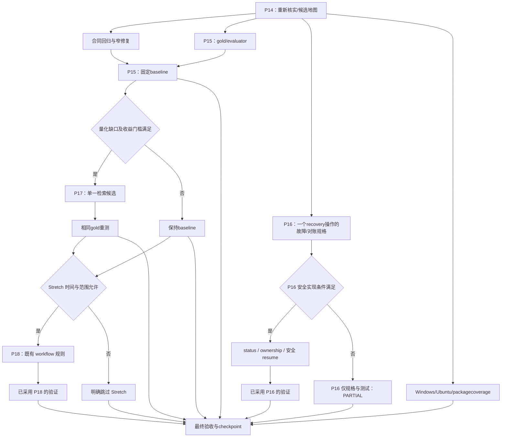

# CogniVault Three-Day Autonomous Development Plan

> **For agentic workers:** REQUIRED SUB-SKILL: Use superpowers:subagent-driven-development or superpowers:executing-plans to execute adopted tasks one by one. This document is the execution framework produced by the pre-audit; the current audit does not start implementation.

**Goal:** 2026-10-07 下午至 2026-10-10 下午，在保留现有权威数据和 Gateway 边界的前提下，交付主线缺口证据、可重复 retrieval baseline 及有证据的窄修复。

**Architecture:** 保留 canonical`cognivault`、SQLite/files/QMD 和薄 Host。先复用审查已有候选、固定合成 gold，再按测得的缺口决定一项检索改进。有限恢复最多覆盖一个既有管理操作，不能扩成 Agent runtime。

**Tech Stack:** Python≥3.11、pytest、MCP stdio、SQLite、QMD 2.8.3；可选 PDF/OCR 依赖保留现状。

## Global Constraints

- 基线：HEAD/remote main `c4e8b63e0425c7c89e9e03ed3f104ae36e27edbc`；正式 tag`v0.8.0`target`748ef70e7ac29bde3ce6c01d04333ac0ee9e5526`。开工重新核实，不把本报告作为实时 HEAD。
- 来源：[发布后架构预审](../../research/2026-10-07-post-release-architecture-preaudit.md)。P14–P18 为本计划工作包，不重定义历史 milestone。
- 只执行 LOW 和有充分证据的 MEDIUM。HIGH 只记录；不删除 V1/backup，不改真实 StudyVault，不 destructive migration，不 reset hard/clean/force push，不新 DB/graph/vector/Memory 大重构，不 Android/WebUI/Obsidian 重构。
- V2Study/History/Sources/WrongAnswers/Assets 任何数据访问、计数、存在性检查和写入均用正式 MCP/Gateway。当前聊天无 cognivault、缺本 worktree 私有配置：真实 Host/生产验收 UNKNOWN，不建立 direct client/inline overridefallback。
- 工程 test/evaluator 只使用完全人工编写的合成资料和临时 stores，调用现有 Gateway；不从真实记录 copy/改写/脱敏产生 fixture。它们不能冒领真实 HostPASS。
- 保留 source bytes、logical identity、provenance、幂等 payload、version / stale conflict、原 capabilities、未知配置。reported identity 不是 authentication。
- 主线 admin 授予全能力是既有 contract；旧候选不同，不自动移植其行为。target 标签/指纹也不能替代物理隔离或认证。
- 不整分支 merge 或 bulk cherry-pick`codex/v0.8-operational-reliability`。旧代码包名/安装器/权限/候选发布状态均与 main 不同。
- 调度、合并、push/tag/release 不是本次预审交付。本计划不保证 Host 会话连续 72 小时；每节点须可独立接续。

## DAG 与时间预算



最终验收要求必须节点、条件节点的采用或跳过记录及已采用实现的验证。P16 可交付规格/测试并保持 PARTIAL；P17 可保留 baseline；P18 可明确跳过，三者均不阻断收尾。10-07 下午/晚间 P14+P15 gold；10-08 完成 P15 baseline，同时研究 P16；10-09 有限恢复与有门槛的 P17；10-10 上午只做已开始节点与 Stretch，下午前收尾。14:00 仅是下午规划锚点，实际开工变化则压缩 optional 节点，不压缩验证。

## Task 1：P14 复用审查与接续边界（必须，LOW）

**Files:** Read 现有`AGENTS.md`、`docs/privacy-boundary.md`、`docs/current-state.md`、预审报告；Create `docs/research/p14-candidate-reuse-review.md`和`docs/p14-p18-execution-checkpoint.md`。

**Interfaces:** Consumes 当前 repo/ref/status 与只读 Git 对象；Produces 每 slice 的`main_present / candidate_only / absent`证据、拟采用文件和风险，不更改私有配置。

- [ ] 运行`git rev-parse --show-toplevel`、`git rev-parse HEAD`、`git branch --show-current`、`git status --short`、`git ls-remote origin HEAD refs/heads/main`。未知用户变更不覆盖；main 推进时重审受影响路径。
- [ ] 现有 managedworktree 合适则重用；实现时命名`codex/p14-p15-baseline`开发分支，避免在未命名 detached 提交后无法清楚接续。
- [ ] 只读`git show`候选`d2186a9 / 803a953 / b375d86 / 3075048 / 27253cc / db03e6d`，比对当前`src/cognivault/`和 Windowsinstaller。记录候选 handler 缺失与评价分母缺陷。
- [ ] 每项明确实现/测试/docs 是否已经存在；只有证据缺失则补测试/docs，不能重复加同类 service。
- [ ] checkpoint 记录 repo/ref/base、允许文件、用户变更归属、已完成 tests、阻断/下一安全动作。不写真实 query、source payload、私有路径或凭据。

**Acceptance:** 一个不需要旧聊天即可理解的 slice 地图；清楚区分 main、旧候选、history 与当前 Host UNKNOWN。独立审阅可拒绝某 slice 而不阻止 P15。

## Task 2：两个已复现合同缺陷（必须，LOW；权限合同窄修复）

**Files:** Modify `src/cognivault/adapters/wrong_answers.py`、`src/cognivault/transports/mcp_stdio.py`；Test `tests/test_wrong_answers.py`、`tests/test_phase8_permissions.py`、`tests/test_canonical_gateway.py`；Read `src/cognivault/adapters/documents.py`、`normalization/execution.py`。

**Interfaces:** Consumes 现有 Document URI / page、Gateway capabilities；Produces 相同返回 DTO 及错误码，支持 Document 已有页范围，discovery 条件与执行的`read+ingest`一致。

- [ ] 用 65 页人工 formfeed 文本建立 现有 Gateway fixture；验证 Document page 65 可 fetch，而当前 错题 source page 65 失败。补 64、65、999 有效页，1000 无效页，缺页 RESOURCE_NOT_FOUND 与 asset 不可带 page 的边界。
- [ ] SQLite History+inbox、read-only fixture 的 MCP list_tools 必须不暴露 normalize；强制调用仍 PERMISSION_DENIED 且不创建 DB。补 read+ingest、ingest-only、admin 的发现/调用一致性。
- [ ] 先运行上述回归，确认它们在当前实现下揭示缺陷，不能只添加当前行为的镜像断言。
- [ ] 页上限复用 Document 已公开的`MAX_PAGES`，不另造一份常量。修 normalize 工具分类/可见性时保持需要 read+ingest 的最终规则，不能“让调用成功”而扩大权限。
- [ ] 验证针对性测试与现有 source / version conflict / permission 回归：

```powershell
uv run --locked --extra dev --no-editable pytest -q tests/test_wrong_answers.py tests/test_wrong_answer_mcp.py tests/test_phase8_permissions.py tests/test_canonical_gateway.py tests/test_mcp_stdio.py
```

- [ ] 审阅 diff：无新增私有 target/权限 grant、无 schema 更改、无 source identity 漂移；以独立小 commit 记录完成结果。

**Acceptance:** 65–999 有效文档页能登记 source；只读 discovery 与 write enforcement 一致；原权限、错误码、幂等和版本行为保持兼容。不得把这一 batch 冒领生产验收。

## Task 3：P15 gold 与评价器（必须，LOW）

**Files:** Create `tests/fixtures/retrieval/manifest.json`及`study/documents/wrong_answer/history/cases.json`；Create `scripts/evaluate_retrieval.py`、`tests/test_retrieval_evaluation.py`；报告`docs/research/p15-retrieval-baseline.md`。可复用`27253cc`的 runner 思想，但不整体复制旧包模块。

**Interfaces:** Consumes case schema、合成 fixture aliases 和 现有 Gateway results；Produces 每 case 原始 ranking/locator/scope/elapsed/errors、每域 summary 和`unsupported`coverage。

- [ ] 固定 32 cases、每域 8 例、至少 10 干扰对象；query types 与 gold 字段严格按预审第 6 节。先写 gold 和 revision，禁止从检索输出反生成 expected。
- [ ] `expected_locators` 与 `expected_support` 逐 relevant ID 记录；验证两者 keys = `relevant_ids` = grade≥2 的集合。多页 case 必须各自对应页码，非适用字段为 null 并计入 coverage，不能用单个 expected page 判断全部结果。
- [ ] 评价单位：Study 文件、Document chunk/page、Wrong Answer source、canonical History conversation；旧 History items 与 source-only metadata 另列 path，不混统计。
- [ ] 实现 Recall@1/3/5/10、MRR@10、source / page / citation case correctness、no-result precision+negative empty recall、filter consistency、locator coverage、cold / warm median / p95。graded nDCG/model judge 不实施。
- [ ] 先用人工故意错误列表测试计分：重复 ID 只计一次；漏检=0；错页/错书失败；positive 搜空拉低 no-result precision；永不搜空不能冒领 negative PASS；errors 不是 empty；unsupported 不静默消失。

评价器应满足下列独立 gold 断言：

```python
# Gold relevant IDs are authored before the ranking.
expected_locators = {
    "book-a:p65:c2": {"source_id": "book-a", "page_number": 65, "chapter_id": "fractions"},
    "book-a:p66:c1": {"source_id": "book-a", "page_number": 66, "chapter_id": "fractions"},
}
expected_support = {
    "book-a:p65:c2": ["Independently authored explanation"],
    "book-a:p66:c1": ["Independently authored worked example"],
}
gold = set(expected_locators)
assert gold == set(expected_support)
ranked = ["book-b:p65:c2", "book-a:p65:c2", "book-a:p65:c2"]
# Recall@1 = 0; Recall@3 = 1/2; MRR@10 = 1/2.
# A returned book-b page does not earn book-a source/page accuracy.
# A returned book-a:p66:c1 matches its own page-66 gold, not page-65 gold.
```

- [ ] unsupported filter 只标能力缺口；不可在 client 筛除后声称 Gateway filter 正确。citation 只评价 returned retrieval evidence，不声称 Agent 回答正确。
- [ ] 给 QMD 合成 runtime 明确 Node/CLI 版本，建临时资料和派生 index；不扫描真实 StudyVault/QMDsourceindex。所有其他域通过合成 Gateway 初始化/调用。
- [ ] 运行评价器单测，完成 code / fixture / revision / profile / version manifest 的 roundtrip 校验。

**Acceptance:** 故意漏检/错页/假空结果不能得到满分；gold 独立；真实数据未进入 fixture 或 Git。其价值是可量化 baseline，不是 6 例全部 1.0。

## Task 4：P15 当前实现 baseline（必须，LOW）

**Files:** `scripts/evaluate_retrieval.py`、上述 fixtures、`docs/research/p15-retrieval-baseline.md`、checkpoint。

**Interfaces:** Consumes Task 2 的合同兼容实现与 Task 3 gold；Produces 同一 snapshot 下四域当前 ranking/错误/定位/latency，以及量化 gap。

- [ ] 锁定 HEAD、fixture hash、limit、seed/query order、Python/QMD 依赖版本；不引入新 retrieval backend。
- [ ] 索引先建好，cold 为新进程 first request；warm 每 query≥5 次重复，保存 raw elapsed 与 timeouts。QMD 每次 Node/临时 runtime 开销计入 Gateway 完整时间，不伪称 OS cache cold。
- [ ] 输出每域结果、coverage/N/A/unsupported、matched IDs、source / page gold、errors；报告宏平均和分子/分母，避免不同检索单位混算。
- [ ] 增加合成索引 incremental / rebuild equal hit set 测试、相同 query warm / cold result 比较。只修改临时派生 index。
- [ ] 分类每个 gap：缺 API filter、algorithm 漏检/ranking、无法定位、capacity 边界、fixture / evaluator 错误、未知 production effect；先修评价器错误，不能归咎检索。

**Acceptance:** P15 可重复生成；现有算法无需全部达满分，但每个缺口有 case 与结果证据。没有测得 gap 就保留当前实现。P15 完成不依赖真实 MCP 连接。

## Task 5：P16 有限 recovery（应该，MEDIUM；先测试/规格）

**Files:** Test `tests/test_recovery.py`与新的`tests/test_operation_recovery.py`；Review 旧候选`operations/ledger.py / resume_package.py`；采用时新增聚焦的`src/cognivault/operations/`模块及既有 runtime/recovery/transport 集成。先写`docs/research/p16-finite-recovery-contract.md`。

**Interfaces:** Consumes 一个现有`recovery_snapshot`的 snapshot key、可信 target binding、input fingerprint、当前领域 artifact proof；Produces 脱敏 status、owner/lease 信息、明确 supported resume 或 unsupported；原始 payload 不进入 job ledger。

- [ ] 固定 scope 只覆盖`recovery_snapshot`。不得因候选有多 kind enum 就承诺所有 ingestion/normalization/batch/cancel 都支持。
- [ ] 独立复现 catalog fsync 后 rename 失败：catalog 存在/final 缺失；同 key 重试失败、partial 保留。补 commit-before-receipt、final 成功但 response 丢失、worker 仍活跃三种 case。
- [ ] 规格明确每阶段证据/下一步：published 且完整校验通过→已完成；完整 stage+catalog 一致且无活跃 owner→是否可安全发布；incomplete/mismatch/未知 owner→needs_action/unsupported，绝不盲重建或覆盖。
- [ ] 先实现可查询 status 与副作用对账，再采用最小持久 ledger。用户已禁止新数据库：不引入候选的 `operations.sqlite3`，仅采用既有受控账本或私有状态文件；若无法在此边界内可靠实现，就交付规格和测试，保持 PARTIAL。
- [ ] lease/fencing 只有在可证明旧执行者不能继续提交时才进入 automatic resume；heartbeat 过期本身不证明进程停止。没有安全 handler 明确 unsupported，不能返回 resume 成功。
- [ ] 合成 tests 覆盖进程重开、重复 submit、stale / target conflict、partial、旧 worker、receipt loss、恢复后 Gateway readback；保持原容量 guard 与 partial 保全。原数据不修、不删。
- [ ] recovery manifest 兼容性、旧 snapshot 读取、privacy/status schema 及针对性 regression 通过后，才纳入最终 candidate。失败则交付规格/测试与明确 PARTIAL，不靠降低门槛强行完成。

**Acceptance:** 一个已知操作的状态与恢复决策可确定，或准确 fail-closed；不是全能 durable runtime。Task 3/4 可与本任务研究并行；修改共同 Gateway/transport 时顺序集成。

## Task 6：P17 一个测得的 retrieval 改进（条件，MEDIUM）

**Files:** 只选一个：Document metadata/page filter 的 既有 contract/adapter/transport；或可重建 Document FTS index；或利用 既有 section/page 的 deterministic rerank。Test 相应域 tests 及 P15 gold，报告`docs/research/p17-retrieval-comparison.md`。

**Interfaces:** Consumes Task 4 同 gold/limit/scope 的失败 case；Produces 单一候选 profile 的结果，不重写 source/原始 Asset/权威 schema。

- [ ] 明确候选类型与对应收益：ranking / index 至少两个 query 类型有可复现 gap；scope / filter 窄修复须有具体越范围或无法表达目标范围的 case。不能把 baseline“有结果”当收益证据。
- [ ] 排序：先 source / pagescope 安全，再 Document FTS/BM25 候选，再轻量 rerank；现有 QMD BM25 不重新实施。禁止 vector/Elasticsearch/Neo4j/graph/新引擎。
- [ ] 在双方支持的固定 case 集合上以同 gold/limit/scope 跑 A/B；ranking / index 的相关域 Recall@5 或 MRR@10 宏平均≥+0.05，未修复域无回退。新增 supported cases 另报 coverage，不改变共同支持集合的分母。
- [ ] scope / filter 须零越范围并保留范围内应召回证据；不要求已满分的 Recall/MRR 继续上升。所有候选的 source / page 与既有 filter 安全正确率不能下降。
- [ ] warm p95 增长>20%须有具体收益依据；不为了分数调 gold。候选无收益时不采用，保留 comparison 证据与原 baseline。
- [ ] 若触及稳定 chapter ID、学习 event 或 authority schema 重写，退出本 task，记 HIGH，不实施。

**Acceptance:** 只有实测收益及边界回归支持的一个候选进入主线准备；合成改善不外推为真实教材效果。

## Task 7：P18 日常入口与 cross-platform 证据（Stretch / 独立 LOW）

**Files:** 现有`src/cognivault/workflows/wrong_answer.md`、`tests/test_wrong_answer_mcp.py`、使用文档；`.github/workflows/ci.yml`只有被 coverage 证据要求时修改。

**Interfaces:** Consumes 既有工具与 schema；Produces 保存后 bundle 回读步骤、找教材/回顾入口的准确限制、平台证据表。不复制 wrong-answer 规范正文。

- [ ] 在唯一 workflow 补显式 save 后 bundle 回读、id/version/source/provenance 比对及 partial report；不要让“analysis revision”代表 new attempt。
- [ ] 找教材入口使用 既有 search/fetch/source / page，清楚说明缺 scope 字段；回顾入口若无 time API 不猜日期、不分析虚构反复错误。新增 time filter 只在 Task6 同等级证据/规格下单独采用，默认不做。
- [ ] CI 矩阵区分 unit、synthetic stdio、真实 runtime 的合成测试、native Host。Windows selected tests 绿不称 full Windows CI；junction/PyMuPDF/QMD skip 列明。
- [ ] 已有 wheel/sdist/install 脚本不复刻。后续 code 变更后重验 build/privacy/独立 install 及已采用的 runtime paths。

**Acceptance:** 产品入口不会宣称尚未存在的功能；本轮 native Host 缺失仍 UNKNOWN。Stretch 不阻断必须项收尾。

## Task 8：10-10 收尾与 stop（必须，LOW）

**Files:** 上述 reports/checkpoint 与必要 current-state 引用；不改历史 checkpoint 事实。

- [ ] 已采用变更完成 targeted regression 后，运行安全合成全集，真实 data/CLI override opt-in 禁用；完整记录失败与 skip。不得用 deselected 结果冒领 full PASS。
- [ ] 运行`uv lock --check`、`git diff --check`、wheel/sdist 内容审计、独立 wheel install；检查工作树/staged/待发布 artifact 无私有配置/路径/query/payload。
- [ ] 若创建 PR 则等待精确最终 HEAD 的 CI，附 PR artifact；本预审不授权自动 merge/tag/release。无 PR 也可交付 reviewable diff 与 checkpoint。
- [ ] 分别报告当前 code / synthetic、CI、native Host、production 四层证据；UNKNOWN 不会被历史 PASS 替代。
- [ ] 保存 最终 repo/ref/diff、fixture version、采用/放弃候选、风险、失败原因、下一安全动作。10-10 下午收尾时不新开功能。

**Stop:** 达到必须项且无测得收益就停止；权限/identity/source 破坏、活跃 worker 不明、capacity 不足、需 HIGH 变更时停止依赖节点并保留证据。缺 MCP/Host trust 时继续无关合成工程，不绕过。没有理由为了填满三天而扩张功能。
